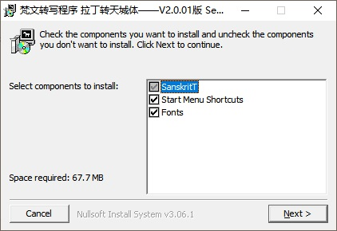
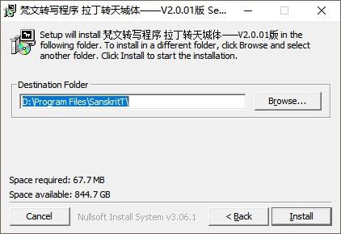
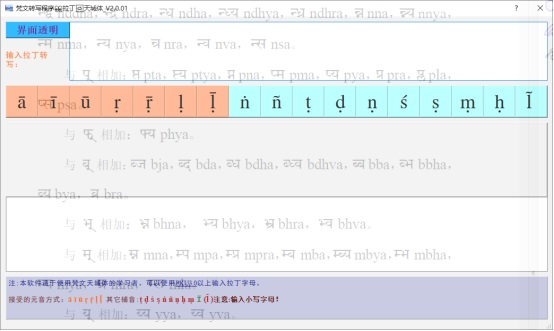
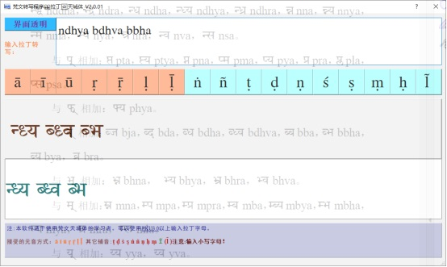
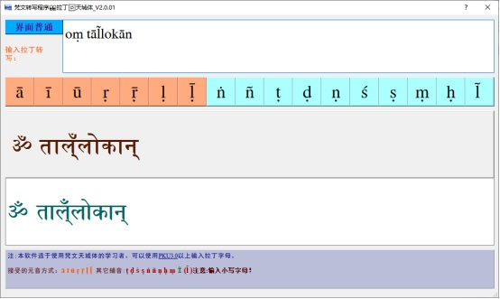
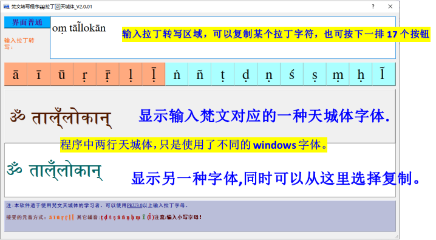
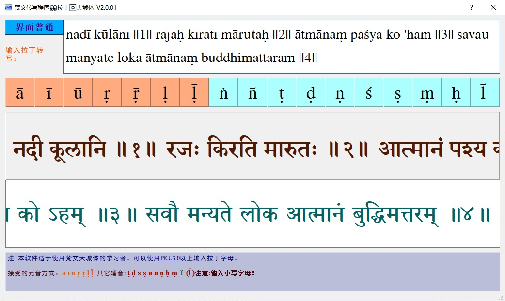

# sanskritT
# 梵文转写程序 V2.0.01
#### 介绍
👉梵文拉丁转写程序，可以使用北大PKU3.0的输入法，Keyman输入法，AutohotKey软件等录入梵文的拉丁转写。
能动态输出拉丁转写对应的梵文的天城体。

## 安装:
### 在Windows系统上双击安装程序，

### 程序会自动安装3种字体
### "Indic Times" , "Sanskrit Text" , "Sanskrit 2003"

### 选择自己想要安装的路径上就可以了。
### 可以在桌面建一个快捷方式！

## 使用：

### 默认程序是半透明的。你可以自己设置透明的程度。
### 方便初学者抄写天城体。

上图的背影是《梵文基础》的教材，下图是抄写了几个连写。

### 点一下“界面透明”按钮，按扭变成不透明。

## 功能区域介绍:
### 使用PKU3.0输入法，可直接输入。

### 如果没有可以COPY注解的字母。也可以按上面两底色的字母。

### 使用Keyman输入法，也可以直接输入。
|拉丁|输入方法|拉丁|输入方法|拉丁|输入方法|
|----|--------|----|--------|----|--------|
| ā  | / + a  | ī  | / + i  | ū  | / + u  |
| ṛ  | / + r  | ṝ  | /+_+ r | ḷ  | / + l  |
| ḹ  | /+_ +l |    |        |    |        |
| ṭ  | / + t  | ḍ  | / + d  | ś  | " + s  |
| ṣ  | / + s  | ṅ  | * + n  | ñ  | " + n  |
| ṇ  | / + n  | ḥ  | / + h  | ṃ  | / + m  |
|  |  |  |  |  |  |

### 程序中的第二行天城体可以选中，复制出来。

### 我把上图实际使用过程中的内容复制如下：
#### 下面是拉丁字母：
## nadī kūlāni ||1|| 
## rajaḥ kirati mārutaḥ ||2|| 
## ātmānaṃ paśya ko 'ham ||3|| 
## savau manyate loka ātmānaṃ buddhimattaram ||4||
#### 下面是天城体：
## नदी कूलानि ॥१॥ 
## रजः किरति मारुतः ॥२॥ 
## आत्मानं पश्य को ऽहम् ॥३॥ 
## सवौ मन्यते लोक आत्मानं बुद्धिमत्तरम् ॥४॥

#### 参与贡献

1.  Fork 本仓库
2.  新建 Feat_xxx 分支
3.  提交代码
4.  新建 Pull Request

#### 特技

1.  使用 Readme\_XXX.md 来支持不同的语言，例如 Readme\_en.md, Readme\_zh.md
2.  Gitee 官方博客 [blog.gitee.com](https://blog.gitee.com)
3.  你可以 [https://gitee.com/explore](https://gitee.com/explore) 这个地址来了解 Gitee 上的优秀开源项目
4.  [GVP](https://gitee.com/gvp) 全称是 Gitee 最有价值开源项目，是综合评定出的优秀开源项目
5.  Gitee 官方提供的使用手册 [https://gitee.com/help](https://gitee.com/help)
6.  Gitee 封面人物是一档用来展示 Gitee 会员风采的栏目 [https://gitee.com/gitee-stars/](https://gitee.com/gitee-stars/)
